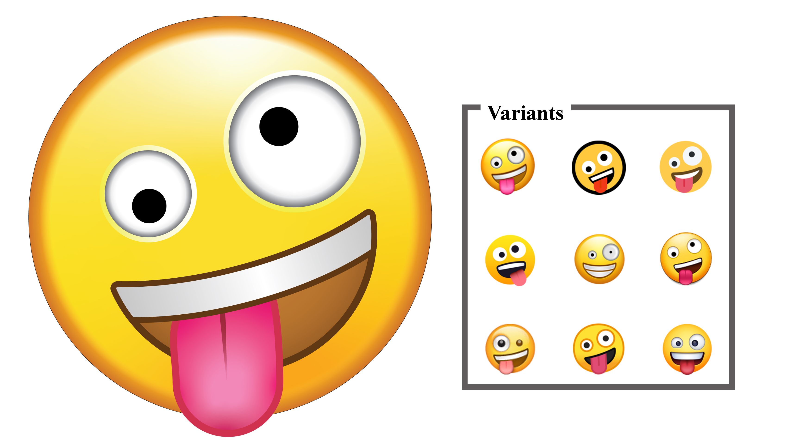
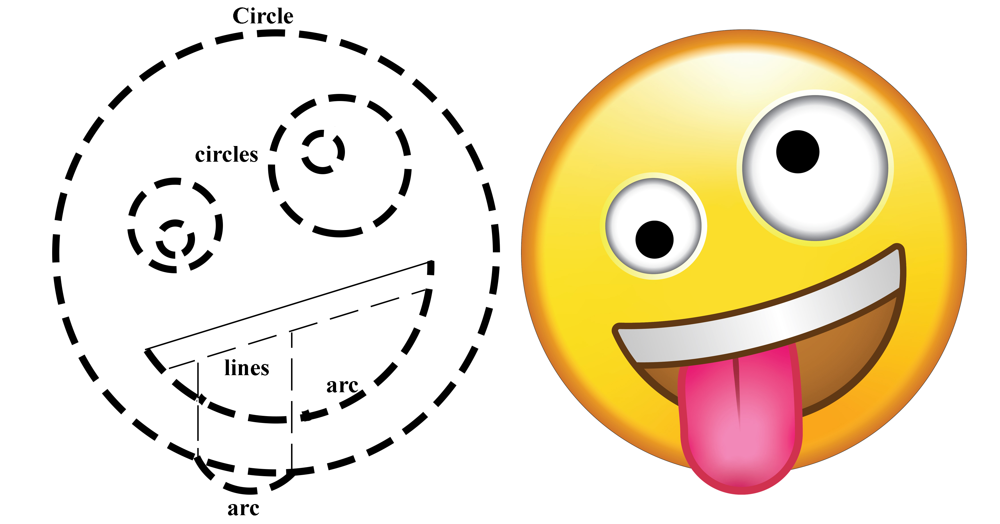
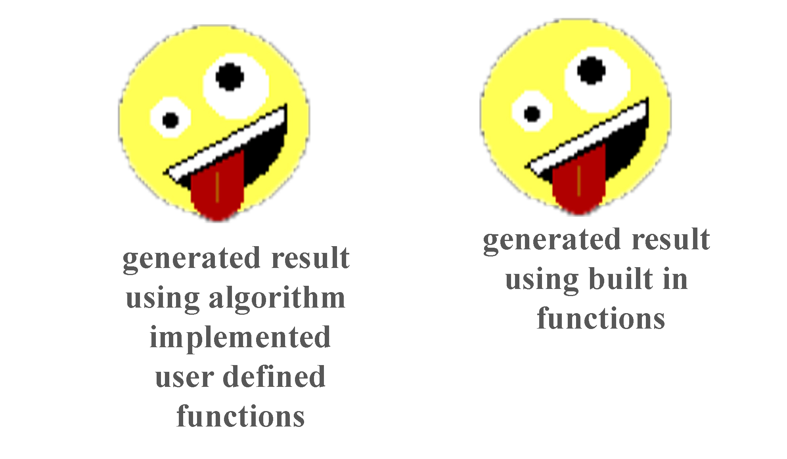
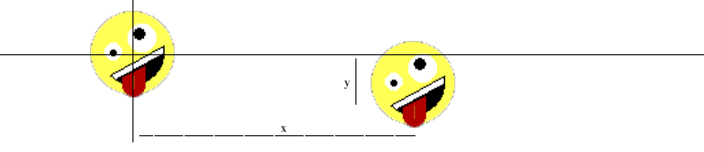
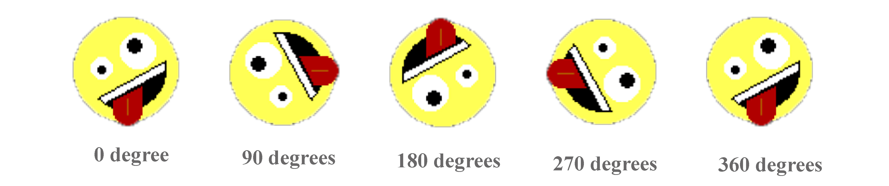
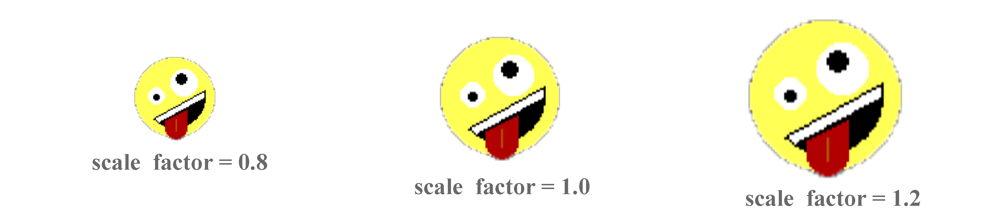
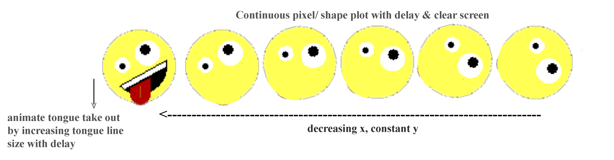

# Computer Graphics using C programming

##### Statement: Select and generate a emoticon and use various computer graphics concepts to draw, fill, translate, scale, rotate and animate.

###### Selected emoticon: Apple's Zany Face

###### About:

This program uses various built in functions of the C graphics library (*graphics.h*) and also implements various computer graphics algorithms for generating **Apple's Zany Face** and perform various graphical operations such as draw, fill, translation, rotation, scaling, and animation.

###### Instructions:

- Turbo C/ C++ under DOSBox was used to compile the program
- BGI was set as the default path in Turbo C/ C++

###### Apple's Zany Face:

A smiley making a silly face. A yellow face with a big grin and wide, white eyes, one larger than the other and in a wild, cockeyed expression. Many platforms, including Apple, depict its tongue stuck out and head tilted; others feature a full-toothed grin, giving it a more unhinged appearance.

Commonly represents such activities as acting goofy, having fun, and partying as well as various senses of slang terms like crazy, usually in a positive manner. May convey a spirit of wackiness more generally.

Also known as:
 • Crazy eyes  	• Excited, wild  	• Goofy face  	• Grinning Face With One Large and One Small Eye

###### Computer Graphics Concepts used for implementation in C:

* Line and Circle drawing algorithms

* Fill algorithms

* Use of graphics library in C																								
* Translation, scaling, rotation and animation

###### C graphics library built-in functions used:

* Circle(x, y, radius);
* arc(x, y, starting_angle, ending_angle, radius);
* line(x1, y1, x2, y2);
* floodfill(x, y, borderColor);
* getpixel(x, y);
* setcolor(colorCode);
* setfillstyle(solid_fill, colorCode);

###### User defined functions for algorithms:

* ddaLine(x1, y1, x2, y2);
* bresenhamCircle(x, y, radius, colorCode);
* floodFillUser(x, y, oldColorCode, newColorCode);
* boundaryFill(x, y, boundaryColorCode, newColorCode);

###### Translation:

To shift origin to given x, y coordinates by adding the origin coordinates to the given x, y respectively.

###### Rotation:

To rotate the emoji in a given angle on axis by calculating the new coordinates through given angle of shapes.

###### Scaling:

To scale/ resize the emoji from a given scale factor by multiplying all the coordinates and sizes by scaling factor.

###### Animation:

To combine above effects with specified delay to perform animation effects.

